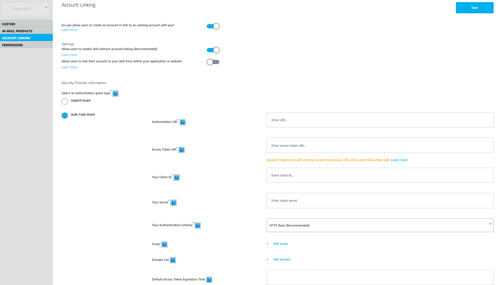

## Setting Up Account Linking

Users will need to log in to their Uber account in order to be able to use the skill. Go to the account linking page in the Alexa developer console, enable the "Do you allow users to create an account or link to an existing account with you?" and "Allow users to enable skill without account linking." options. Then update the "Auth Code Grant" fields.

Note: You will need to enable this in Uber's console and to add "request" and "all_trips" in the "scope" field here.

[Next: Setting Up Permissions](./permissions.md)
