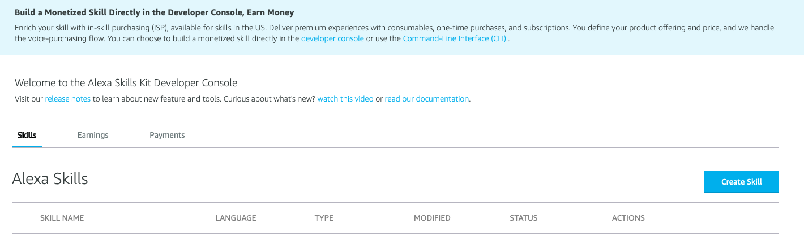
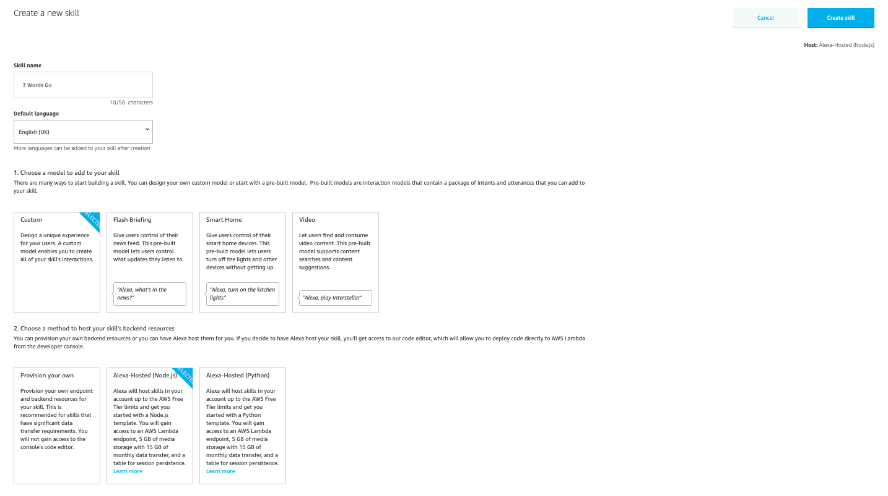
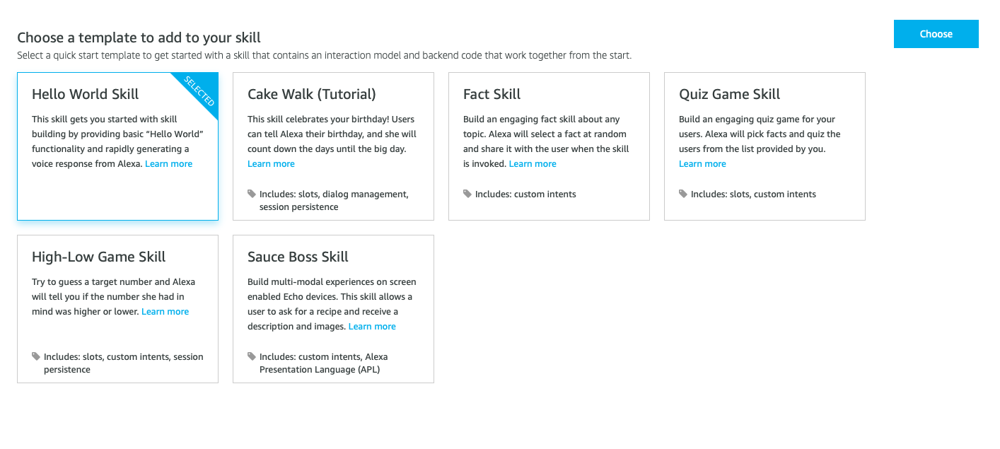
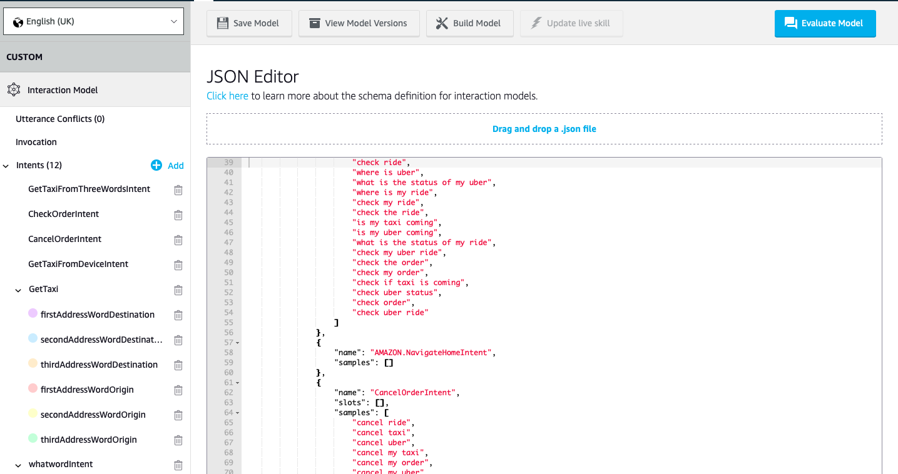
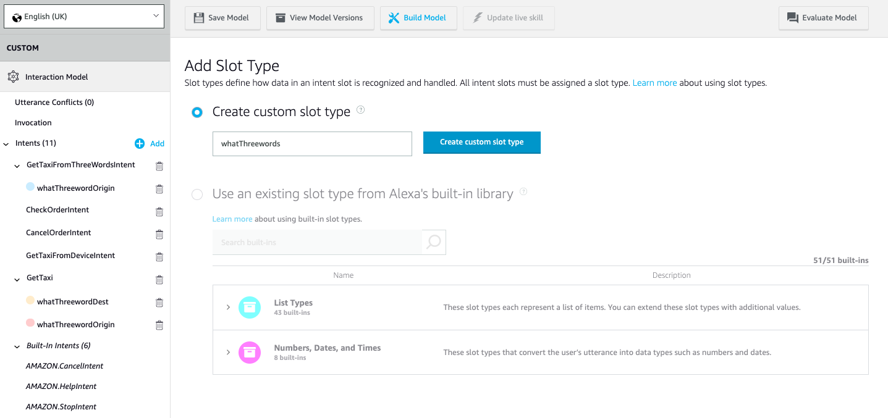
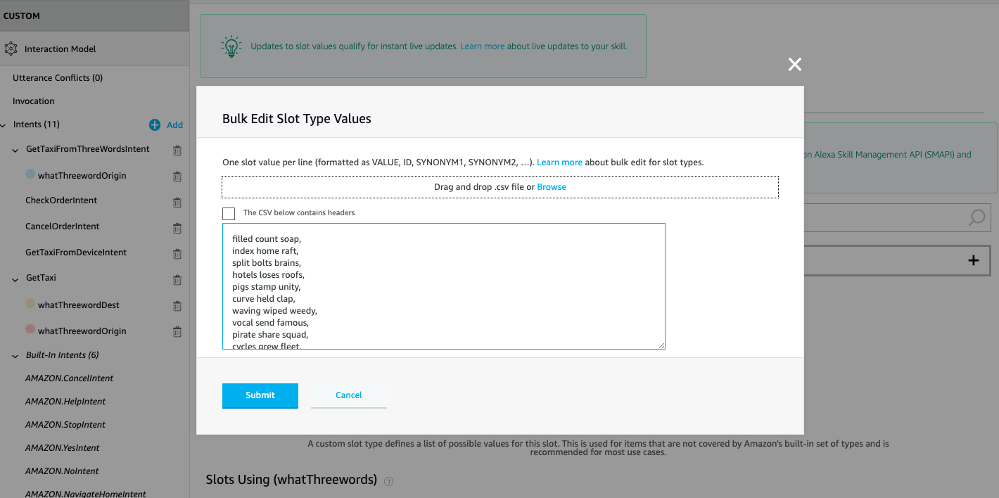
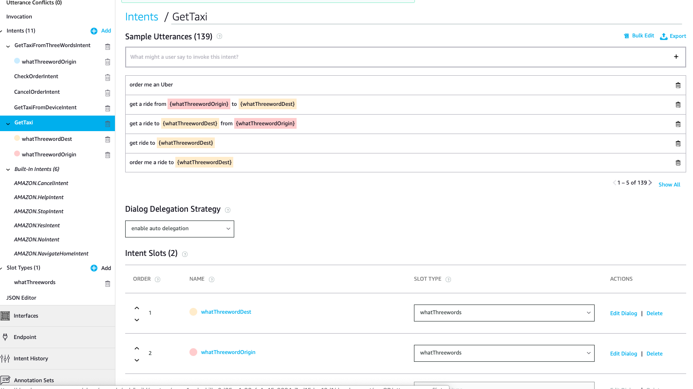

# Create the Voice User Interface

## Step 1: Create a New Skill

Set up an account at https://developer.amazon.com. From the dashboard menu, go to Alexa > Alexa Skills Kit, or go to https://developer.amazon.com/alexa/console/ask and create a new skill by clicking at "Create Skill"

Select a "Skill name", a "custom" model, and an "Alexa-Hosted" backend. Click "Create Skill". This is the name that will be shown in the Alexa Skills Store, and the name your users will refer to. Additionally, change the locale if so desired.

Choose a "Hello World Skill" template.


## Step 2: Upload Interaction Model

Alexa skills are based on an 'interaction model', which maps _utterances_ (spoken phrases) to _intents_ (skill commands) pulling variables from _slots_ in the uttered phrase. We describe these phrases as _samples_.

For instance, a sample for ordering an Uber with What3Words might be:
```
order an uber from {whatThreewordOrigin} to {whatThreewordDest}
```

We have provided a sample interaction model here: [interaction_model.json] …

In the panel on the left, go to Interaction Model > JSON Editor, and then copy in the contents of [interaction_model.json]. Click 'Save', and then 'Build Model'.



# Learn More about Building an Alexa Skill Voice User Interface with what3words

The [interaction model](../models/interaction_model.json) file contains all the intents and slots needed by the skill to work, but if you want to learn how to create your own what3words slots, read the instructions below.

## Creating a Custom Interaction Model (Optional)

Click the **"add"** button next to "Slot Types" on the left side of the page, and choose a name (**"whatThreewords"**) for the custom slot type. Click **"create custom slot type"**.

In this new page, add the "Slot Type Values". Slot type values are examples of the values you expect Alexa to understand within your Skill. You can add the list of example three word addresses as a file, as individual values, or by bulk copying and pasting, as shown in the image below. You can find a sample list of three word addresses here: [what3words.csv](./slot_data/what3words.csv)

Press submit, and you should have a list of slot values as shown. Then, save the model!

## Using the Slot in Your Custom Intent

Click on the add button next to "Intents" on the left-hand side of the page. Choose a name for the custom intent (e.g. "GetTaxi"). Intents contain examples of how users are expected to ask Alexa to perform an action, so in this case, for example, "order me a taxi to index home raft". Here, "index home raft" is a value of the slot we created. In order to train Αlexa to look for all the three word addresses, you should connect the custom slot type with the intent.
Scroll down to "Intent Slots" and add an intent for the slots "whatThreewordDest" and "whatThreewordOrigin". From the slot type list, select the custom type you previously created – "whatThreewords" – for each. It is ok to use the same slot type for as many intent slots you like!

For each of the intent slots, you can click on "Edit Dialog", choose the "Validations" tab, and create a validation rule to fit your skill.
Now, add as many as possible example of phrases you expect users will use to express their particular intent. In this case, users will be ordering a taxi to and from a three word address.
Click ‘Save model’ and then ‘Build model’.
All done! You have trained an Alexa skill to understand the user's intent!

[Next: Setting up the backend](./back-end.md)
