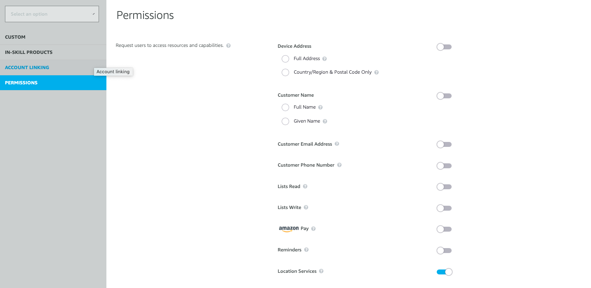

## Setting Up Permissions

Users should provide access to their Alexa device's full address and location services (GPS) when using the skill. Full address and GPS are used when available as an alternative to the user's three word address location. For this reason, you will need to switch on the Location Services permission on the Alexa permissions page.

## Get Testing!

Now you are ready to test your skill! Using an Alexa device or the Alexa mobile app, open your Skill and go through the flow. 

Try completing an order, and try using different phrases to complete each step. This will allow you to see if you need to add further utterances to your interaction model to accurately encompass everything a user might reasonably say to interact with your Skill. You can also invite others to beta test your skill while it is in development (for which you will need to add distribution information) to get an insight into whether your model is robust enough in terms of sample utterances.

[Home](../README.md)
